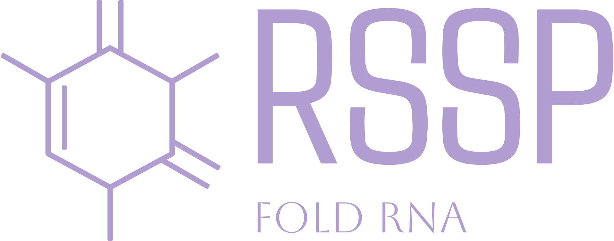

<div align="center">
  
</div>


# RNA Secondary Structure Prediction


## Table of Contents
- [Overview](#overview)
- [Features](#features)
- [Installation](#installation)
- [Usage](#usage)
- [Members](#members)


## Overview
This repository contains the final project for Architecture of large projects in bioinformatics class. The goal of this project is to create an web application that facilitates the prediction of RNA secondary structures using various tools. This application integrates MXFold2, KnotFold, RNAFold and RNAstructure providing a unified interface for users to input RNA sequences, run predictions, and visualize the results.


## Features
- **RNA Sequence Input**: Load RNA sequences from FASTA file or enter sequences directly in FASTA format.
- **Tools Integration**: Seamlessly run [MXFold2](https://github.com/mxfold/mxfold2.git), [KnotFold](https://github.com/gongtiansu/KnotFold.git), [RNAFold](https://github.com/ViennaRNA/ViennaRNA.git) and [RNAstructure](https://rna.urmc.rochester.edu/RNAstructureDownload.html) on the input sequences.
- **Dot-Bracket Notation**: Get the predictions in a dot-bracket format for easy analysis.
- **Result Visualization**: Generate visualizations to help interpret the predicted RNA secondary structures. Our software integrate excellent visualization tool: [Forna](http://rna.tbi.univie.ac.at/forna/)
- **User-friendly Interface**: Simple and intuitive interface for running predictions and viewing results.


## Setting up local app instance
### Prerequisites:
1. Clone repository and move into project directory:
```bash
git clone https://github.com/jbindaAI/RSSP.git
cd RSSP
```
2. Create python virtual environment:
```python
python3 -m venv venv
```
3. Activate virtual environment and install requirements:
```bash
source venv/bin/activate
pip3 install -r requirements.txt
```
4. Clone repositories with models source code into `models` directory:
```bash
cd models
```
* MXFold2 - download official wheel file and install it:
```bash
wget https://github.com/mxfold/mxfold2/releases/download/v0.1.2/mxfold2-0.1.2-cp310-cp310-manylinux_2_17_x86_64.whl
pip3 install mxfold2-0.1.2-cp310-cp310-manylinux_2_17_x86_64.whl
```
* KnotFold - clone official repository
```bash
git clone https://github.com/gongtiansu/KnotFold.git
```
* RNAStructure - download official command line version of RNAstructure program.
```bash
wget https://rna.urmc.rochester.edu/Releases/current/RNAstructureLinuxTextInterfaces64bit.tgz
tar -xzvf RNAstructureLinuxTextInterfaces64bit.tgz 
```


## Usage
Web app is based on FastAPI framework and uvicorn web server. To run it locally, execute:
```bash
cd RSSP
uvicorn main:app --reload
```


## Members
Jakub Binda, Konstanty Kraszewski, Anastasiy Ramanchanka, Michalina Wysocka
